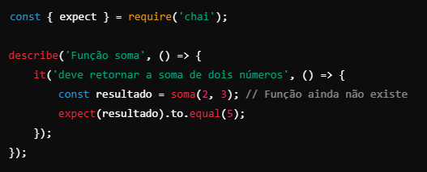
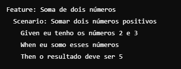
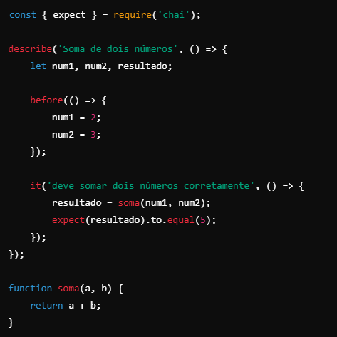
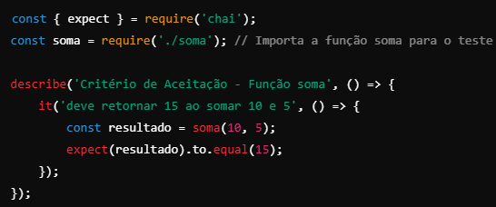
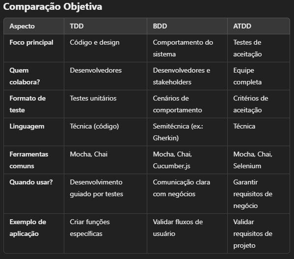

# Desenvolvimento Direcionado por TDD, BDD e ATDD
 ## TDD, BDD and ATDD. 
 Aqui veremos, de forma sucinta uma, introdução à essas três abordagens de desenvolvimento.
  
  

 ## TDD (Test-Driven Development)

 TDD é uma abordagem de desenvolvimento onde você escreve os testes antes de implementar o código. A ideia é que os testes guiem o design do software, garantindo que o código seja funcional desde o início.

 *Como funciona o TDD?*
 O TDD segue um ciclo de três etapas, conhecido como *Red-Green-Refactor*, sendo elas:

 1. *RED:* Escreva um teste que falhe porque o código ainda não foi implementado.
 2. *GREEN:* Implemente o código apenas o suficiente para passar no teste.
 3. *REFACTOR:* Refatore o código para melhorar sua qualidade, mantendo os testes verdes.

 **Exemplo Prático de TDD:**
 Imagine que você está desenvolvendo uma calculadora com uma função para somar dois números. Faremos o exemplo usando JavaScript.

 1. Escreva o teste (Red):
   
   - Este teste falha porque a função *soma* ainda não existe ou não foi implementada.

 2. Implemente o código para passar (GREEN):
   

 3. Refatore o código (REFACTOR):
   - Note que, no exemplo GREEN, o código já está otimizado, pois é um código pequeno para servir apenas de exemplo. Mas, em projetos reais, você ajustaria nomes, estruturas ou lógica.

 ## BDD (Behavior-Driven Development)

 O BDD é uma extensão do TDD que foca nos comportamentos esperados do sistema, expressos em uma linguagem acessível tanto para desenvolvedores quanto para pessoas nãotécnicas, como stakeholders. Utiliza-se ferramentas que suportam sintaxes como **Gherkin**, que descrevem cenários de teste em linguagem natural.

 *Como funciona o BDD?*
 O BDD funciona em três etapas:

 1. Escreva cenários em uma linguagem como Gherkin, como, *Given-When-Then* (Dado-Quando-Então).
 2. Converta esses cenários em testes automatizados.
 3. Implemente o código para passar nos testes.
   
 **Exemplo Prático de BDD:**
 Continuando com o exemplo da calculadora, agora queremos verificar o comportamento da função de soma.

 1. Escreva o comportamento esperado (em Gherkin):
   

 2. Automatize o cenário (Usando Mocha e Chai):
   

 3. Implemente o código da função *soma*:
   - Como pode ser visto no código acima, a função já foi implementada.

 ## ATDD (Acceptance Test-Driven Development)

 Já o ATDD é focado em escrever testes de aceitação antes do desenvolvimento. Estes testes são criados em colaboração entre desenvolvedores, testers e stakeholders, garantindo que todos compartilhem o mesmo entendimento dos requisitos.

 *Como funciona o ATDD?*
 O ATDD também segue 3 etapas:

 1. Reúna a equipe para definir os critérios de aceitação.
 2. Escreva os testes de aceitação.
 3. Desenvolva o código até que esses testes passem.

 **Exemplo Prático de ATDD:**
 Agora, queremos garantir que a calculadora será aceita pelo cliente com base em um *critério de aceitação*.

 1. Defina o critério de aceitação:
   - A função de soma deve retornar a soma correta de dois números positivos.

 2. Escreva o teste de aceitação (Usando Mocha e Chai):
   

 3. Implemente a função *soma*:
   - Assim como no exemplo do TDD, implementamos a função soma para passar no teste.

 ## RESUMO
 Em resumo, TDD é bom para garantir que cada parte do código funcione corretamente. Ideal para desenvolvedores.

 Já o BDD foca em alinhar os comportamentos do sistema com os requisitos do usuário. Ótimo para comunicação entre equipes técnicas e não técnicas.

 Enquanto o ATDD aborda critérios de aceitação antes do desenvolvimento do sistema, garantindo que os requisitos do cliente sejam atingidos.

 Essas práticas podem ser combinadas a depender do projeto.

 A seguir veremos uma planilha onde podemos comparar os aspectos de cada uma das três abordagens, fazendo uma comparação objetiva delas:

 

 **OBS:** Podemos ver que, usando os códigos para testar esses desenvolvimentos direcionados por testes, sejam eles TDD, BDD OU ATDD, estamos praticando **Testes Unitários**. 

 Alguns orgãos de certificação, como para os testes **CTFL**, você poderá reparar que no material de estudo para esta certificação poderá estar escrito que *TDD como: desenvolvimento direcionado PARA testes*. Mas, tome cuidado com esta afirmação pois ela poderá induzir a você que o objetivo do TDD é testar, quando na verdade, o objetivo aqui é desenvolver melhor, usando o teste como uma ferramenta para isso. 