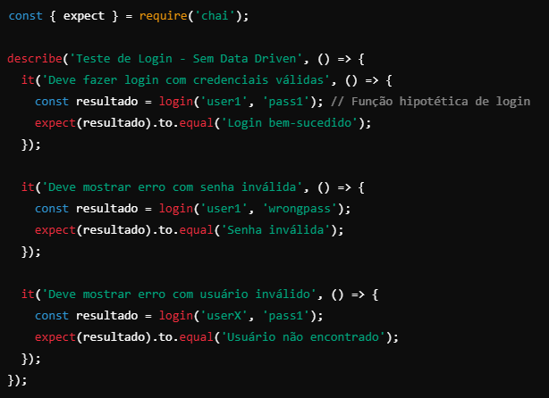

# Testes Data Driven e Keyword Driven
 ## Data Driven and Keyword Driven Testing
 
 Data Driven e Keyword Driven são dois *frameworks* amplamente utilizados em **automação de testes**. Aqui, cada um deles será abordado separadamente com conceitos, vantagens, desvantagens e exemplos práticos.
 
  
  

 ## Data Driven Testing

 O Data Driven Testing é uma abordaem onde os dados de teste (entradas e saídas esperadas) são separados do script de teste. Em vez de codificar os valores diretamente no código, esses dados são armazenados em fontes externas como planilhas, arquivos CSV, bancos de dados ou até mesmo em tabelas específicas no código. A ideia é que o mesmo script possa ser executado várias vezes, com diferentes combinações de dados.

 Ou seja, no Data Driven, os dados de testes são armazenados fora do código, como em arquivos JSON, CSV, ou outros formatos, e o mesmo script é executado com diferentes entradas e saídas esperadas. Facilitando a execução de vários cenários sem duplicar o código.

 *Por que usar Data Driven?*
 Há vários motivos pelos quais usar essa abordagem:
  - Reutilização: O mesmo script pode ser usado para testar vários cenários diferentes.
  - Facilidade de manutenção: Alterar os dados é mais fácil e rápido do que modificar o código.
  - Cobertura maior: É possível testar uma grande variedade de combinaçõe de entrada.
  - Escalabilidade; Você pode adicionar mais dados sem precisar alterar o script.

 **Exemplo Prático:**
 Vamos realizar um exemplo prático de Data Driven Testing, usando a linguagem JavasCript e os framework Mocha e Chai.

 Imagine que estamos testando o mesmo sistema de login: Os cenários incluem:

 1. Login com credenciais válidas.
 2. Login com senha inválida.
 3. Login com usuário inválido.
 4. Login com campos vazios.

     **Sem Data Driven:**
     No código, você precisaria escrever um teste separado para cada cenários:

     Em javaScript ficaria:
     

     **Com Data Driven:**
     Agora, os dados são armazenados em um arquivo JSON, ficando:
     

     E o código usa esses dados dinamicamente, assim:
     
     
 **Vantagens e Desvantagens do Data Driven:**

 *Vantagens:*
 - Com o Data Driven você testa várias combinações de dados sem duplicar código.
 - Facilita a manutenção, tornando os dados facilmente modificáveis sem alterar os testes.
 - Melhora a escalabilidade e organização dos testes.

 *Desvantagens:*
 - O Data Driven requer configuração para gerenciar fontes de dados externas.
 - Depurar erros pode ser mais desafiador usando o Data Driven Testing.
  
   
   

 ## Keyword Driven Testing

 O Keyword Driven Testing vai além do Data Driven. Aqui, você organiza os testes usando *palavras-chave* que representam ações específicas. Em vez de escrever o código completo para cada ação, você define um conjunto de comandos reutilizáveis (as palavras-chave) que são usadas para compor cenários de teste.

 Ou seja, no Keyword Driven Testing, você define palavras-chave que representam ações, como "clicar" ou "inserir texto". Cada palavra-chave é implementada como uma função reutilizável, e os testes são compostos chamando essas palavras-chave.

 *Por que usar o Keyword Driven Testing?*
 Há vários motivos pelos quais usar esta abordagem de automação de testes:

 - Legibilidade: Os testes podem ser lidos e entendidos por pessoas que não têm conhecimento técnico, por exemplo, analistas de negócios.
 - Reutilização: Ações comuns como "clicar em botão" ou "inserir texto" Podem ser definidas uma vez e reutilizadas em vários testes.
 - Separação de responsabilidades: Testers criam os cenários usando palavras-chave, enquanto os desenvolvedores cuidam das implementações.

 **Exemplo Prático de Keyword Driven Testing:**
 Vamos usar agora o mesmo sistema de login do exemplo anterior de Data Driven, só que com ações representadas por palavras-chave.

 - Definindo as palavras-chave:
  Criamos funções reutilizáveis que representam ações:
  

 - Plhanilha de Teste:
  Agora criamos uma planilha de testes com as ações, em arquivo JSON:
  

 - Execução das palavras-chave:
  Por fim, escrevemos o código em JS que executará as palavras-chave:
  

 **Vantagens e Desvantagens do Keyword Driven Testing:**

 *Vantagens:*
  - Legibilidade: Os cenários podem ser lidos e entendidos por analistas que não programam.
  - Reutilização: As palavras-chave podem ser usadas em diferentes testes.
  - Separação: Testadores escrevem cenários; desenvolvedores implementam palavras-chave.

 *Desvantagens:*
  - Mais esforço inicial para configurar palavras-chave.
  - Requer documentação para que as palavras-chave sejam entendidas por toda a equipe.

 ## Resumindo:
 Agora vamos resumir objetivamente essas duas abordagens de automação de testes, definindo os aspectos de cada uma delas, para decidirmos quando usá-las.

 **Aspecto:**

 - FOCO:
     - *Data Driven Testing:* Reutilização de dados.
     - *Keyword Driven Testing:* Reutilização de ações.

 - OBJETIVO:
     - *Data Driven Testing:* Testar várias combinações de entradas.
     - *Keyword Driven Testing:* Tornar testes legíceis e modulares.

 - FACILIDADE:
     - *Data Driven Testing:* Simples de implementar.
     - *Keyword Driven Testing:* Exige mais tempo inicial.

 - ESCALABILIDADE:
     - *Data Driven:* Alta com mais dados.
     - *Keyword Driven:* Alta com novas palavras-chave.