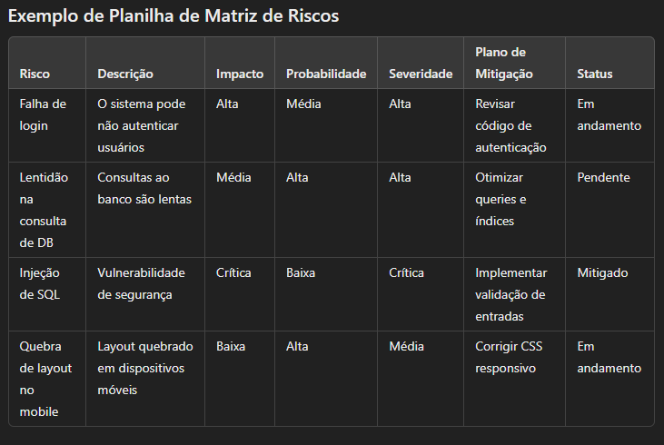
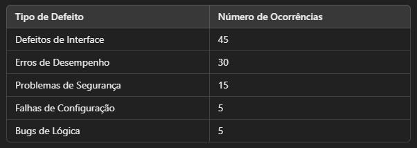
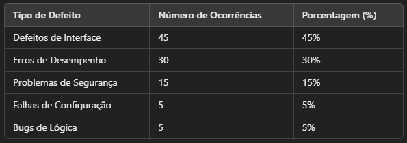
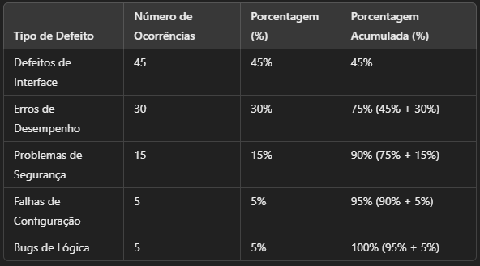
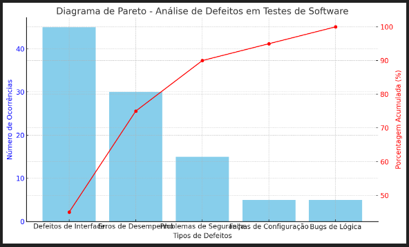

# Planejamento De Testes
 ## Test Planning
 
 Um bom teste exige planejamento e quando planejamos, nós economizamos tempo e dinheiro. 
 Então, planejamento melhora nossa condição de vida, nossas condições de trabalho, nossa própria experiência como profissional dentro de uma empresa e a própria experiência da empresa conosco como profissional.
 
 Não é fácil.
 Podemos falar uma série de coisas que no papel, no mapa mental, é fácil, mas na prática é algo que teremos que exercitar e, muitas vezes, iremos falhar.
 Planejar não é uma coisa que se aprende e pronto, planejar é algo que se pratica, que se faz de novo e de novo. 
 Errou? Como eu posso melhorar isso?
 Assim, cada vez você será uma pessoa mais eficaz em criar um bom plano.

 "Planejamento é ouro, mas, planos não são nada"
    - Dwight Eisenhower 
 
 O plano dificilmente vai ser exatamente seguido à risca, pois, o oponente, o próprio mercado profissional e o próprio mercado onde o software está inserido, está em constante mudança e em constante evolução. 
 Então, nós sempre precisamos corrigir, alterar e ajustar o plano. 
 Agora, o planejamento é quando você enxerga quais são as possibilidades, quais são os possíveis planos, afim de, quando um problema surgir, e ele vai surgir, você será capaz de decidir o que fazer rapidamente.
 Por isso planejamento é muito mais importante do que o próprio plano em si.

## Negociando um acordo Flexível e de valor
 ### Negotiating a Flexible and Valuable Agreement

 Já que sabemos que os planos podem mudar, precisamos ter um acordo flexível, pois, ele tem que prever a mudança.
 O que faremos se for necessário ter hora extra, o que faremos se o escopo mudar, o que faremos se o prazo mudar. Então, basicamente, precisamos lidar com o que fazmos fazer, o que vamos testar e quando será a entrega.
 Esses são os grandes fatores que a gente tentará prever e ajustar no plano e deixar em aberto uma margem e combiná-la com o cleinte, com os usuários, enfim, com as áreas de negócio.
 
 Então, se eu vou reduzir o prazo, provavelmente o custo irá aumentar ou diminuir. Se eu diminuir o que vou entregar, provavelmente vai diminuir o custo, mas, se eu for aumentar o que vou entregar? Então terá que aumentar o prazo. "Mas não podemos aumentar o prazo", então teremos que aumentar o custo. "Mas não podemos aumentar o custo", então provavelmente irá diminuir a qualidade, pois, se eu tenho que fazer mais coisas, ao mesmo tempo, pelo mesmo custo, o que será afetado será o nível de qualidade do que vou ter.

 Tudo bem, então temos que criar um acordo flexível junto com o cliente. Do que ele está disposto a abrir mão, do que podemos flexibilizar, do que ele pode flexibilizar.
 Esse acordo tem que ser alguma coisa de valor, ou seja, qual a importância desse software, desse produto, dessa funcionalidade para o cleinte? Se ele tivesse que abrir mão, ele abriria mão do quê? De qual funcionalidade?
 Então temos que ter um ranking, por exemplo, de quais são as funcionalidades mais importantes para o cliente, pois, se teremos que abrir mão, já sabemos que iremos abrir mão das últimas.

 Muitas vezes, todo mundo fala do valor das horas gastas. Só que as vezes uma coisa que demora poucas horas pode trazer um retorno financeiro imenso para a empresa e, uma coisa que demora muitas horas, pode ser uma obrigação que a empresa tem que fazer por questões legais.
 
 Às vezes, a gente que está envolvido tecnicamente no projeto não enxerga esse valor.
 Então temos que conversar de maneira franca e direta com o cliente, com o gerente de produto, para identificar o que deve ser feito, como fazê-lo e o que é realmente mais importante.
 
 E não esquecer do conceito de mínima qualidade viável, chamada pela sigla em inglês MVP. O que é essa mínima qualidade viável? É aquilo que faz o software ser algo utilizável, mesmo que não seja perfeito, algo que eu vou ver valor enquanto usuário e cliente, se ele fizer menos do que aquilo, ele já não presta.
 Isto varia muito de produto para produto e de segmento para segmento e exiga que a gente conheça bem o mercado onde estamos inserido.
 
 Essa percepção faz a diferença e ajuda a diquirí-la conversando com o time, com o cliente, com o usuário e quando você experimenta o produto. Isto faz parte do teste também. Você começar a enxergar se existe algo no software, por exemplo, que faz falta e que seria muito importante para o cliente. Ou se existe alguma coisa que está sobrando e que, de repente, não precisa mais de uma evolução porque já está bom o suficiente, não precisa estar perfeito, poderia ter mais coisas, mas, para o que se propôe, está bom o suficiente.

 Então é interessante e importante praticar a mínima qualidade viável.

 Muitas empresas de tecnologia e muitos clientes de empresas de tenologia, no começo, acham que se a gente "der um gás" aqui vai dar certo. Não, não dá, não existe mágia.
 Se eu quero fazer mais, eu vou precisar de mais tempo e vou precisar de mais dinheiro. Se eu quero fazer mais rápido, vou precisar diminuir o que eu tenho para ser feito, ou, ter mais dinheiro. Quanto mais as empresas amadurecem e quanto mais os profissionais amadurecem, mais fica claro as soluções que se precisam ter. O problema é que, muitas vezes, se quer melhorar tudo sem fazer nenhum investimento. Isto não dá certo.

## Plano de Teste
 ### Test Plan

 Empresas mais tradicionais ou empresas que são obrigadas por questões de mercado ou por legislação, precisam ter um planejamento mais formal, um controle mais formal do que será testado, pois, se der alguma coisa errada será preciso mostrar que se teve preocupação com isto antes.
 
 Então veja, se existe um software comercial como o de uma loja, por exemplo, se der uma coisa errada, perde-se muito dinheiro. Então é preciso ter um plano de como eu vou testar o software no site para não perder dinheiro.
 Outro exemplo é se for um software para atividades de uma corretora de compra e venda de ações do mercado financeiro, onde ela precisa garantir que o produto dela funciona, que o serviço que ela presta funciona, mas também, precisa prestar contas para um orgão regulador e controlador de mercado. Então se aconteceu alguma coisa de errado, além de ter o problema de ter acontecido algo de errado, também terá de justificar para o orgão que faz o controle do segmento porquê aquilo aconteceu e, se eu não tiver a habilidade, números e informações para mostrar que aquilo foi algo que a gente se precaveu, eu posso comprometer a empresa.

 Por isso, o plano de teste precisa ser preparado mais detalhadamente e com mais calma.

 Normalmente, o plano de teste nada mais é do que um contrato entre a nossa equipe, o cliente, ou as várias equipes envolvidas e o cliente, no sentido de acertar o que será feito e deixar claro qual é a responsabilidade de cada um, o que cada um irá fazer e ver se está faltando alguma coisa que não estamos percebendo.

 Em um plano de teste é importante ter uma lista do que será feito, que é o escopo do que será testado, mas, também, é importante marcar o que não será testado, para não gerar expectativa de algo que não irá acontecer. Deixar claro o que será e não será testado é uma maneira de melhorar o planejamento e de melhorar a qualidade, por consequência.

 Outra parte importante do plano de teste é o cronograma. Quando iremos testar até quando precisa ser entregue o software. O tempo é uma coisa muito preciosa e limitada, por isso, eu preciso ter uma ideia clara de quanto irei gastar de tempo, em que datas terei que fazer certas atividades, qual é o prazo final, se ele é negociável ou inegociável, muitas vezes, por demandas legais, por questões de mercado, de datas-chave.

 Então virá o que vai permitir que façamos tudo isso, o orçamento. Não existe nada sem dinheiro no mundo capitalista.

 Por isso, devemos saber quanto irá custar para fazer esses testes entre pessoas, recursos, serviços, profissionais terceirizados, consultoria... É preciso ter uma visão clara e bem precisa desse valor. Quase sempre esse valor vai ser levantado e mostrado para a organização, aí, a empresa irá aprovar ou não aprovar e fazer cortes.
 Existem empresas que são muito grandes e que já possuem a equipe montada, com tudo disponível para seguir em frente. Então, às vezes, elas não tem uma preocupação tão grande com o orçamento em  si, mas elas tem uma preocupação fortíssima com o cronograma, por que tempo é dinheiro.

 O orçamento e o cronograma são dois pontos chaves para as empresas e que se relacionam.

 Outro ponto chave é a qualidade. Existem empresas que nem sempre olham para a qualidade de uma forma realmente profissional, elas não tem indicadores e nem metas.

 O que seriam indicadores de qualidade? Existem indicadores de quantidade de bugs, bugs por áreas do software, tendência de aumento ou redução de bugs e tempo entre encontrar e solucionar um bug. Existem algumas métricas e indicadores que nos ajudam a saber e a prever quantos defeitos iremos ter. 
 
 Imaginemos que para cada história de usuario que teremos, encontraremos 5 bugs, por algum motivo. Então se chegou a 10 histórias de usuário, eu sei que eu devo me preparar para encontrar algo em torno de 50 bugs. No entanto, se chegou apenas a 10 bugs. Então, há alguma coisa errada pois se esperava achar 50 e só achamos 10. Teremos que mudar a técnica, por exemplo. Existe um dos 7 principios do teste chamado "Paradoxo do pesticida", onde pode-se ocorrer de um mesmo conjunto de testes, que são repetidos várias vezes, não encontrarem novos defeitos após um determinado momento. Para superar este paradoxo, os casos de testes necessitam ser frequentemente revisados e atualizados e um conjunto de testes novo e diferente precisa ser escrito para exercitar diferentes partes do software para aumentar a possibilidade de encontrar mais erros.
 Então, eu tenho que inventar uma outra forma para pegar outros defeitos.

 Então veja como indicadores nos ajudam até a saber se naquele ponto já terminou os testes.

 E a gente tem que ter metas. Por exemplo, nosso objetivo é reduzir de 5 bugs por história de usuário para 4 bugs por história. Para isso a gente vai ter treinamento, para isso a gente vai fazer acompanhamentos e medir lá na frente. E quando conseguir, quem tiver 4 vai tentar ter 3 e quem tiver 3 vai tentar ter 2 e assim por diante.

 Outro ponto chave é o Risco.
 O que pode dar de errado no software. 
 Pode dar coisas erradas no projeto como atrasos, impedimentos, uma pessoa do time sair, uma pessoa nova ser contratada... Então, muitas coisas podem acontecer no andamento do projeto que irão fazer o projeto andar mais rápido ou devagar, ou até mesmo atrasar. Tudo visto na ISO 25.010 são possíveis falhas que um produto pode ter.
 Temos que estar de olho no que pode dar errado, no que típicamente ou o mais revelante poderia dar de errado naquele produto.

## Mapa Mental como Alternativa ao Plano de Testes
 ### Mind Map as an Alternative to the Test Plan

 Uma ótima alternativa ao plano de teste de uma maneira mais ágil e menos formal seria você usar um mapa mental. Um mapa mental pode ser usado no lugar de um plano de teste plenamente, podendo ser uma maneira simples e rápida de montar um plano, apenas mapeando as ideias centrais, sem muito detalhamento.

 Basicamente, no mapa mental a gente mapearia as áreas chaves do software, aquelas áreas de gestão de projetos como cronograma e escopo, mas tendo também custo, prazo, equipe, recursos disponíveis, funcinalidades e o que precisa ser desenvolvido, o que precisa ser testado, usar ícones para marcar o nível de teste, "puxar um fiozinho" para explicar mais detalhadamente qual o critério de aceitação, etc.

## Requisitos Funcionais e Não Funcionais
 ### Functional and non-functional requirements

 Um aspecto importante durante o planejamento é enxergar entre as histórias, entre o que tem que ser feito para o nosso cliente, para o nosso produto, quais são os requisitos funcionais e quais são os requisitos não funcionais.

 **Requisitos funcionais** são requisitos de negócio, ou seja, requisitos que descrevem como nosso cliente quer fazer negócios, como ele quer vender, como ele quer comprar, como é que ele quer atender o seu público.

 Então, se os nossos requisitos funcionais são requisitos de negócio e de como a empresa quer trabalhar, de como ela atende, Ela deve seguir uma característica de qualidade, regida pela ISO 25.010, chamada *Adequação Funcional*.
 
 Dentro desta característica da qualidade, temos que ter toda aquela preucupação se o software faz o que deveria fazer, se ele não faz alguma coisa diferente do previsto, se ele vai ter realmente o comportamento que nós esperamos.

 **Requisitos não funcionais** são requisitos técnicos, ou seja, como a gente vai viabilizar aquela construção, aquele produto, daquela forma.

 Quando a gente fala do não funcional, que são os requisitos técnicos, ou seja, como esse software vai ser feito, vai ser realizado, Nós temos todas as demais características da qualidade, o que seria tudo, menos a adequação funcional, na ISO 25.010. Então, todas as outras características da qualidade, como: Usabilidade, compatibilidade, confiabilidade, eficiência, manutenibilidade, portabilidade, segurança, todas elas são características técnicas, ou seja, características funcionais.

## Estórias de Usuários
 ### User Stories

 O planejamento depende completamente de entendermos o que o cliente quer. Hoje em dia, nós chamamos o desejo do cliente, a sua necessidade, de *estória do usuário*. Resumidamente, a estória do usuário é aquilo que o cliente pediu para a gente fazer, o que ele quer que seja construído, que seja entregue.

 Podemos ter várias estórias de como o software deve ser construído, como ele deve ser testado, que podem formar algo maior, mas, cada estória tem que ser independente e tem que descrever bem o que a gente precisa construir e o que precisa testar.
 
 Outro ponto chave é ela ser negociável, como vimos anteriormente.

 É imporatne, também, é entender o quão estimável aquela estória é. Se eu consigo pegar um estória e saber dizer quantas horas serão gastas com ela ou quão valiosa é determinada estória de usuário. 
 
 Então, a estória precisa ter informações suficientes para a gente poder dizer não, dizer se vale a pena ou não gastar recursos naquela estória, naquela função do software. É preciso ter informação para fazer uma estimativa, mas, e se uma estória não tem informação para que esta estimativa seja feita? Você terá que poerguntar mais. Você, como profissional de teste, terá que interpretar e dizer se você possui informação para fazer essa estimativa de quanto tempo gastará para construir algo do software. Você poderá ter que conversar com o cliente, com o gerente de produto, enfim, tentar obter mais informações para que determinada estória seja estimável.

 Quando alguém usa no texto da estória de usuário frases como: Esta estória tem que ser rápida, tem que ser segura, tem que ser fácil de navegar, tem que ter layout moderno, etc. São todas informações muito subjetivas, essas informações não são mensuráveis, não são estimáveis. Eu precisaria que o cliente dissesse quantos cliques vai ter o processo de compras, quantos segundos pode demorar para carregar uma página, eu gostaria que ele me definisse protocolos de segurança ou padrões de segurança a serem seguidos. Ou seja, é preciso transformar aquilo de "rápido, moderno, seguro,..." em algo palpável, algo que dê para estimar e, também, algo que seja testável, que lá na frente consigamos ver que aquilo que foi pedido que o software faça foi conseguido ou não.

 Apesar de tudo isso, a estória não pode ser grande e complicada demais, ela precisa ser objetiva e direta. Ela não precisa ser extremamente curta, mas, tem que ter o tamanho suficiente, sem enrolação.

Um foco muito grande, deve ser definir, junto com o PO, os *critérios de aceite*, ou seja, o que eu preciso testar para provar que aquilo está funcionando? O que precisa dar resultado para que você fique convencido de que está funcionando? Esse é um ponto muito importante, não existe teste sem critério de aceitação, não existe teste sem resultado esperado. Por isso, ele precisa ser objetivo, ele precisa ser uma informação, um critério, que eu consiga medir, consiga ver claramente se deu certo ou se deu errado.

Essas estórias vão ficar reunidas no **Product Backlog**, que é basicamente um conjunto de todas as estórias de usuários que tivermos. Isto é focado muito no Product Owner, mas todo mundo do time pode colaborar com essa criação. Então, essas estórias, todas elas são priorizadas pelo PO, ele é que é a pessoa que deveria ter a visão do negócio para saber qual seria um ranking da estória mais importante até a estória menos importante para o negócio.

## Sprint

 Um outro conceito que estamos todo o tempo repetindo e que é uma ideia muito fácil de entender é o Sprint.

 O que é uma Sprint? É um ciclo de trabalho no qual a gente vai escolher quais estórias vamos realizar. 

 Então temos um conjunto grande de estórias do Product Backlog, escolhemos quais estórias irão fazer parte do *Sprint Backlog*, ou seja, o que faremos nesta Sprint. É simplesmente um ciclo de entendimento, construção, teste e entrega, mas, que  é um desafio para que sejamos capazes de entregar um produto com qualidade e dentro de um prazo que, muitas vezes, é curto. 

 No XP, ou, *Extreme Programming* trabalhamos com o conceito de Sprint durando uma semana. Já no *Scrum*, varia de duas a quatro semanas, sendo que não devemos ficar variando o tempo de duração de cada sprint, se será duas semanas, então todas as sprint devem durar duas semanas. Também existe o *Kanban*, que pode até não ter Sprint, ou ele pode ter Sprint como o Scrum, pois, ele quer atender as demandas de uma maneira mais individual, porém, para atender as demandas de uma maneira individualizada, não como grupo, eu preciso ter muita automação de teste, porque eu preciso garantir que qualquer menor mudança não vai quebrar o que já está funcionando. Muita gente acha que o Kanban é só um tipo de quadro do Scrum, mas o Kanban vai muito além disso. No caso do Kanban, não precisa ter Sprint, mas, no caso do XP e do Scrum é obrigatório ter um período de tempo para que a gente possa construir, testar e implantar.

## Sprint Backlog

 O Sprint backlog é aquilo que nós selecionamos. As estórias que nós selecionamos para aquela Sprint ou uma estória mais complexa, mais demoraa. As vezes uma Sprint pode ter várias estórias menores, médias ou grandes, pode haver uma mistura, dependendo da capacidade do time.

 Então, esse Sprint Backlog é sobre o que nós somos realmente capazes de fazer dentro de um ciclo determinado.

## Épicos
### Epics

 Nem todas, mas algumas empresas organizam, também, as suas estórias em Épicos. Um épico é uma estória grande.
 
 Vamos imaginar um épico como uma visão do todo, ou seja, várias estórias que se juntam para formar uma estória maior, bem ampla, uma grande entrega, com um conjunto de funcionalidades, um conjunto de estórias mais relevantes do que uma estória sozinha. Éssa é a ideia central por trás do épico.
 Nem tudo pode ser resolvido em duas semanas, como o tempo de uma sprint, por isso temos que ter essa visão um pouco mais ampla, saber onde queremos chegar, ter uma grande visãoo dos nossos objetivos e metas.

## Análise de Riscos
### Risks Analysis

 Uma das formas mais eficientes de planejar os seus testes é a partir de uma análise de riscos.
 Você tendo requisitos funcionais e não funcionais, estórias, épicos, etc. Então, você já começa a ter um primeiro vislumbre do que pode dar errado e essa informação ou conjunto de informações é que irão te ajudar a fazer uma boa análise de riscos.
 
 A análise de riscos nunca deve ser feita sozinha, ela deve ser, no mínimo, feita em conjunto com o time, mas, seria bom se envolvesse pessoas de todas as áreas e que, de alguma forma, são impactadas pelo projeto.
 O risco é algo que pode dar errado, que tem chance de dar errado, pois, quando temos certeza de que algo dará errado, então isso é um problema, não um risco.

 Agora, como é o processo de análise de risco? Como fazemos para analisar o risco?
 Normalmente, a área de análise de riscos é dividida em algumas etapas.
 A primeira etapa é a **identificação** dos riscos, o que normalmente envolve fazer reuniões com o time e/ou com outros times para discutir o que pode dar errado e o que não pode dar errado.
 Uma vez que fazemos a identificação, então começamos a analisar. Primeiro, é uma lista bruta do que pode dar errado, depois, começamos a ter uma lista com algum grau de detalhe, até termos uma lista que vai ter uma probabilidade dos itens da lista dar errado.
 Normalmente começamos com uma escala simples: probabilidade alta, média ou baixa.

 Também temos que considerar o **impacto** que aquele risco com chance de acontecer, terá sob o produto, como um fator que pode ser de prejuízo para a empresa, o cliente e/ou o produto.
 Escalamos o impacto, também, em alta, média e baixa escala, mas, também podemos escalar o impacto em números, como 1, 2, 3.

 A próxima etapa seria o processo de **priorizar** os riscos a serem evitados. Para isto, existe uma fórmula de risco que definimos como: **R = P x I**, ou seja, risco é igual a probabilidade multiplicado pelo impacto.
 Essa fórmula costuma cair em todo tipo de exame de certificação de gestão de projetos. A prtir desta fórmula, fazemos a conta para cada risco e, uma vez que temos todos os riscos calculados, podemos fazer um ranking do maior risco para o menor.
 A partir daí, eu já sei por onde começar, qual risco atacar e porque eu tenho que atacar esse risco.

 Essa ideia de seguir um ranking já serve como uma introdução, também, ao conceito de Análise de Pareto.

 Em seguida, começamos a estabelecer uma **Estratégia de tratamento dos riscos**. Sabendo qual risco é maior, qual risco é medio e qual risco é menor, podemos agora definir estratégias para eliminar ou evitar o risco.
 eliminar um risco em um projeto não garante que aquele risco não volte a contecer, pois, por alguma falha de gestão, aquele risco pode voltar a existir. Então, não podemos garantir que um risco seja eliminado para sempre e nunca mais volte.
 O que podemos fazer é mitigar, minimizar ou prevenir um risco, reduzindo a sua probabilidade de acontecer ou o impacto do risco, caso aconteca, geralmente trabalhamos em um ou  outro, ou em reduzir a probabilidade ou em reduzir o impacto.

 Também podemos *aceitar passivamente* um risco e não trabalhar nem mesmo para mitigar, prvenir ou elminar esse risco. Nesses casos, estamos lidando com riscos ínfimos e de baixíssimo impacto no projeto, e definimos que lidaremos com esses riscos caso o encontremos durante o desenvolvimento do produto.
 Então, esse risco se daria em uma situação que, se não tiver nenhum outro contexto de criticicidade, poderia ser aceitável e só seria testado, trabalhado nele, em último caso, se sobrar tempo para isso.

 Há, também, a forma de *aceitar ativamente* um risco, com um plano de contingência.
 Por exemplo: Encontramos um bug onde os clientes não conseguirão trocar a senha pelo site, até este defeito ser resolvido, deixamos o suporte preparado para a demanda de reclamações sobre este problema, e/ou, avisamos os clientes, colocando um banner por exemplo neste caso, para visar que este erro existe e para o cliente entrar em contato com o suporte para trocar a sua senha enquanto este problema estiver sendo trabalhado.
 Então, aceitar ativamente um risco é saber que ele pode acontecer e já deixar planejado o que fazer caso o risco aconteça, ou seja, estar preparado para agir somente se e quando o risco acontecer.
 Lembrando sempre de planejar os riscos com todos os envolvidos no risco e no projeto do produto, para não deixar, neste exemplo, a equipe de suporte despreparada para ele.

 Outra estratégia de tratamento de riscos seria transferir o risco, no caso para outra empresa. Um exemplo dessa estratégia seria o negócio de seguros, como o seguro de automóveis por exemplo. No seguro de automóvel, você está pagando para uma seguradora assumir o risco no seu lugar.
 Agora, no caso de softwares, não existem empresas de seguros. Nesses casos, temos o exemplo de terceizar o desenvolvimento de um software, então há algumas cláusulas em contrato que podem ser usadas caso o software construído por essa terceirizada dê algum problema, para indenizar prejuízos operacionais de perda de clientes, de perda de negócios.
 De toda forma, mesmo que um problema do seu software gere uma indenização por parte da empresa terceirizada que o desenvolveu, ainda há o prejúizo da imagem da sua empresa que, como já vimos, é de suma importância. 
 Portanto, há de se considerar que, no caso de softwares, não há como transferir totalmente um risco para outra empresa.

 Com tudo isso, temos também que **acompanhar os riscos**. Porque os riscos são dinâmicos, a chance de um risco acontecer pode aumentar, diminuir ou permanecer constante, então precisamos acompanhar os riscos para saber se eles estão aumentando ou diminuindo, por isso, deve se definir um período de acompanhamento dos riscos.
 O período que definiremos para acompanhar um risco dependerá da natureza do risco. Tem riscos que deverão ser acompanhados frequentemente, outros diaramente, semanalmente, quinzenalmente, mensalmente ou anualmente, para cada risco que você listar, você deve definir de quanto em quanto tempo você irá voltar a olhar para aquele risco.
 Ainda, terá de ser definido um responsável para aquele risco, alguém que terá que acompanhar e será responsável pelo risco em questão.

## Matriz de Riscos
### Risks Matrix
 O instrumento principal da análise de risco é a chamada *Matriz de Risco*.
 A matriz de riscos na qualidade de software é uma ferramenta que ajuda equipes a identificar, priorizar e mitigar riscos durante o processo de desenvolvimento e testes de software.
 Ela se concentra em possíveis falhas que podem impactar a qualidade, como bugs críticos, falhas de segurança ou problemas de desempenho e auxilia na priorização de esforços de teste.

 *Importância da Matriz de Riscos em Qualidade de Software*

 - Priorização de Testes: A matriz ajuda a focar em áreas críticas que podem ter um impacto maior na qualidade, garantindo que os testes sejam realizados de forma eficiente.
 - Gerenciamento de Riscos: Ao identificar riscos de forma proativa, a equipe pode implementar estratégias de mitigação, como adicionar testes extras ou corrigir bugs prioritários.
 - Redução de Custos: A resolução antecipada de riscos evita problemas caros e demorados que podem surgir na produção.
 - Comunicação: A matriz oferece uma maneira clara de comunicar quais riscos são mais preocupantes e por quê.
 
 Exemplo de uma matriz de riscos: 

 

 Como Funciona este exemplo:
 - Identificar Riscos: A equipe de qualidade e desenvolvimento identifica possíveis riscos que podem comprometer a qualidade do software.
 - Avaliar Impacto e Probabilidade: Cada risco é avaliado quanto ao impacto (o quão grave seria) e à probabilidade de ocorrer (a frequência com que isso pode acontecer).
 - Determinar Severidade: A severidade é calculada com base no impacto e na probabilidade, ajudando a priorizar quais riscos abordar primeiro.
 - Plano de Mitigação: Define as ações necessárias para mitigar ou eliminar o risco, como a implementação de testes específicos ou ajustes no código.
 - Monitorar o Status: Acompanhar o progresso de mitigação de cada risco, ajustando conforme necessário.
 
 Como Usar esta planilha de matriz de risco:
 - Preencha a lista de riscos com base no sistema ou na funcionalidade em teste.
 - Atribua valores de impacto e probabilidade para cada risco (por exemplo, Alta, Média, Baixa).
 - Calcule a severidade (geralmente, uma combinação de impacto e probabilidade, como uma pontuação).
 - Descreva o plano de mitigação e mantenha o status atualizado para acompanhar o progresso.

## Análise de Pareto
### Pareto Analysis

 A análise de Pareto, ou diagrama de Pareto, nos ajuda a chegar em uma priorização dos testes, nos ajuda a saber por onde começar a testar e ele sempre se baseia em você ter algum tipo de restrição. Essas restrições podem estar relacionadas com o prazo, o orçamento, com as pessoas ou com os recursos.

 A Análise de Pareto é baseada no princípio 80/20, que sugere que, em muitos casos, 80% dos problemas são causados por 20% das causas. Esse princípio ajuda a identificar e priorizar os problemas mais significativos para que a equipe possa focar onde terá o maior impacto.
 Em um projeto de software, é comum que uma pequena quantidade de módulos ou funcionalidades seja responsável por uma grande parte dos bugs ou falhas.

 Já o *Diagrama de pareto* é um gráfico de barras que organiza causas de problemas(como tipos de defeitos) em ordem decrescente de frequência.

 Como Criar e Interpretar um Diagrama de Pareto em Testes de Software:
 - Identifique os Problemas: Reúna dados sobre os defeitos ou falhas encontradas no software, como o número de falhas em cada módulo ou o tipo de defeito (por exemplo, falhas de interface, problemas de segurança, bugs de performance, etc.).
 - Classifique e Conte: Organize os problemas por frequência, listando quantas vezes cada tipo de falha ocorre.
 - Crie um Gráfico de Barras: Coloque os tipos de defeitos no eixo X (horizontal) e a frequência de ocorrências no eixo Y (vertical), em ordem decrescente.
 - Adicione a Linha Acumulada: Calcule a porcentagem cumulativa de defeitos e plote uma linha no gráfico para mostrar o impacto acumulado.

 O Diagrama de Pareto revela que a equipe deve focar primeiro em resolver os defeitos que são responsáveis pela maior parte dos problemas. Corrigir esses defeitos terá o maior impacto na melhoria da qualidade do software.

 Os benefícios de utilizar a análise de pareto em um ambiente de qualidade de segurança de software são:
 - Priorização: Permite que a equipe concentre seus esforços nos problemas mais críticos do software.
 - Eficiência: Reduz o tempo gasto em problemas menos significativos e melhora a qualidade geral do produto mais rapidamente.
 - Decisões baseadas em dados: Fornece uma base objetiva para decisões de priorização, permitindo a equipe realizar testes e resolver os problemas certos.

 **Cenário de exemplo do uso de análise de Pareto em um projeto de software:**

 Imaginamos que você trabalha em um projeto de software onde a equipe de QA está analisando os tipos de defeitos mais frequentes encontrados durante o teste. Aqui estão os dados coletados sobre as falhas nos testes:

 

 - Passo 1:
 Primeiro precisamos somar o total de defeitos:
    - Total de ocorrências: 45 + 30 + 15 + 5 + 5 = 100

 - Passo 2:
 Agora calculamos as porcentagens de cada defeito:
    

 - Passo 3:
 Então, calculamos a porcentagem acumulada de defeitos:
    

 - Passo 4:
 Com base nisso, criamos o nosso *diagrama de Pareto* para visualizarmos melhor:

    

 Explicando este diagrama de pareto:
 - Gráfico de barras: Este gráfico de barras mostra o número de ocorrências para cada tipo de defeito.
 - Linha de porcentagem acumulada: A linha indica como os defeitos contribuem para o total acumulado. Podemos observar no exemplo que os dois primeiros tipos de defeitos(Defeitos de interface e Erros de desempenho) correspondem a 75% de todos os problemas do software.

 Depois que fazemos a nossa análise de Pareto e montamos o nosso  diagrama, então podemos utilizar várias táticas ou estrégias de priorização dos defeitos a serem solucionados.

 Usando o exemplo do diagrama acima, estas táticas de priorização são:

 - **Prioridade por Impacto Crítico**
 Descrição: Essa abordagem prioriza os defeitos que têm o maior impacto no usuário ou no funcionamento do sistema, mesmo que não sejam os mais frequentes.
 Aplicação no Exemplo: Se os Problemas de Segurança (15% dos defeitos) puderem comprometer seriamente a segurança do sistema, eles podem ser priorizados acima de defeitos mais frequentes, como  Defeitos de Interface.
 Vantagem: Garante que problemas críticos não passem despercebidos, especialmente quando relacionados a riscos de segurança ou falhas que podem causar grandes prejuízos.
 - **Prioridade por Frequência de Ocorrência**
 Descrição: Neste caso, os defeitos mais frequentes são priorizados, porque são responsáveis pela maioria dos problemas enfrentados pelos usuários.
 Aplicação no Exemplo: Defeitos de Interface (45 ocorrências) e Erros de Desempenho (30 ocorrências) seriam priorizados, pois juntos representam 75% dos problemas.
 Vantagem: Resolve problemas que afetam um grande número de usuários, melhorando a experiência geral rapidamente.
 - **Prioridade por Custo de Correção**
 Descrição: Os defeitos são priorizados com base no custo e no esforço necessários para corrigi-los. Defeitos que podem ser corrigidos rapidamente com baixo custo são tratados primeiro.
 Aplicação no Exemplo: Se os Bugs de Lógica (5 ocorrências) podem ser corrigidos facilmente, mesmo com um impacto menor, podem ser tratados para obter resultados rápidos.
 Vantagem: Permite que a equipe obtenha vitórias rápidas e faça progressos visíveis, o que pode ser motivador e estratégico.
 - **Prioridade por Risco**
 Descrição: Envolve priorizar defeitos que apresentam o maior risco para a estabilidade ou segurança do sistema. Aqui, o risco é uma combinação de probabilidade de ocorrência e severidade do  impacto.
 Aplicação no Exemplo: Se os Problemas de Segurança são menos frequentes, mas representam um alto risco de falha catastrófica, eles podem ser tratados antes de defeitos com menor risco.
 Vantagem: Reduz a probabilidade de falhas críticas ou catastróficas, protegendo a reputação do sistema e a segurança dos dados.
 - **Prioridade por Valor para o Cliente**
 Descrição: Foca nos defeitos que, quando corrigidos, proporcionam maior valor ao cliente ou usuário final. Isso pode incluir melhorias na usabilidade ou correção de problemas irritantes.
 Aplicação no Exemplo: Se corrigir os Defeitos de Interface aumenta significativamente a satisfação do cliente, isso seria uma prioridade alta.
 Vantagem: Melhora a experiência do usuário e a percepção do software de forma rápida.
 - **Prioridade por Dependências**
 Descrição: Correções são priorizadas com base em dependências técnicas, como defeitos que precisam ser resolvidos antes que outras correções possam ser implementadas.
 Aplicação no Exemplo: Se Erros de Desempenho impedem a execução eficiente de outros testes ou funcionalidades, eles precisam ser resolvidos primeiro.
 Vantagem: Garante um fluxo de trabalho mais eficiente, reduzindo bloqueios técnicos.

 Geralmente nos seus testes, você deve priorizar aquilo que tem mais reclamações, mais defeitos, mais falhas, daquilo que é mais usado, primeiro. Ou seja, utilizar a priorização por valor para o cliente.

 No entanto, também temos a **Análise de Cauda Longa**.

 A análise de cauda longa refere-se a situações onde um grande número de eventos ou itens menos frequentes, somados, podem ter um impacto maior.
 Em vez de apenas se concentrar nos problemas ou defeitos mais frequentes, a Análise de Cauda Longa enfatiza a importância de também considerar os eventos menos frequentes, que, juntos, podem representar uma grande parte do risco geral.
 Então, a ideia da cauda longa é que não é o sufuciente mais testar só o que é mais importante. É bom que se lembre que é sempre priorizar a Análise de Pareto primeiro, no entanto, também é importante perguntar: O que eu farei com tudo aquilo que não irei testar?
 Há uma gama de itens que não testaremos, seja por tempo ou recursos, então, usaremos a cauda longa para termos uma amostragem resto.

 *Defeitos de Baixa Frequência*: Estes são os defeitos que abordaremos com a Análise de Cauda Longa, pois, ocorrem raramente mas podem ter implicações sérias, por exemplo: Vulnerabilidades de segurança que se manifestam em condições específicas, então, ignorar um problema como esse pode expor riscos críticos do sistema.
 A análise de cauda longa nos permite ter uma *cobertura completa de riscos*, ajudando a garantir que vulnerabilidades não sejam negligenciadas. Então, com ela, usamos *abordagens abrangantes de testes*, para, não apenas testar áreas óbvias e frequentes, mas também criar cenários que simulam condições raras epouco comuns.

 Então **como realizar a análise de cauda longa?**
 1. Coletamos e analisamos dados de defeitos, identificando tanto problemas comuns quanto aqueles mais raros mas potencialmente perigosos.
 2. Mapeamos a frequência dos defeitos, destacando a "cauda longa" de eventos raros.
 3. Planejamos os testes para cobrir essa cauda longa, criando cenários de testes que abordem esses eventos raros, simulando esses cenários e condições raras e, inclusive, realizando testes de cenários em condições extremas, como testando servidores em carga máxima ou falhas de sistemas em cascata, ou mesmo ataques distribuídos.
 4. Por fim, priorizamos os testes de cauda longa com base no risco, como vimos em análise de riscos, avaliamos quais defeitos raros tem o maior potencial de causar danos graves e priorizamos tais testes.
 
 Realizar a estratégia de Análise de Cauda Longa nos permite ter uma melhor cobertura de segurança do software, aumentando a resiliência do mesmo, garantindo que ele possa lidar com ataques incomuns ou condições raras.
 também nos garante uma prevenção proativa, detectando problemas antes que possam ser explorados.