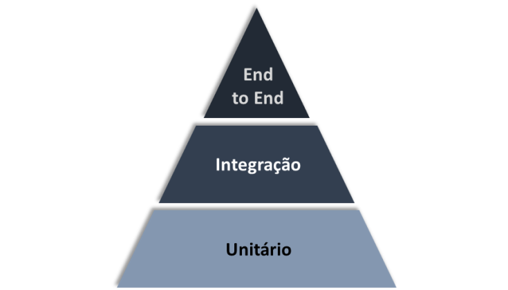

# Design de Teste - Test Design

 ## Pirâmide de Testes - Test Pyramid

 A ideia de estratégia da pirâmide de testes é que consigamos entender em quais momentos e como e quanto devemos focar em cada tipo de testes. 

 A pirâmide de testes é muito importante e muito utilizada no mercado hoje para definir estratégias de testes.

 Abaixo iremos ver **os três tipos de teste** dentro da pirâmide de testes. Esta pirâmide que iremos ver mistura os conceitos do Martin Fowler junto com os conceitos do Google apresentados no livro *Software Engineer at Google*

 

 No livro  *Software Engineer at Google* o teste unitário cobre 80% da pirâmide, restando 15% para testes de integração e 5% para testes *end-to-end*.

 1. *Unitário*
   
      A  base da pirâmide, ou seja, a maior parte da pirâmide. Quanto mais próximo eu tenho um teste da parte unitária dentro da pirãmide, mais rápido esse teste executa e mais barato fica. Porque o teste unitário é um teste rápido de ser feito e pequeno, ou seja, não depende de muitas coisas para executar ele e, assim, temos um feedback rápido se a aplicação está dando sucesso ou falha.
      
      O teste unitário é um tipo de teste que visa testar individualmente as partes e componentesmenores e fundamentais de um sistema, como funções, métodos ou classes.

 2. *Integração*
   
      A integração possui uma fatia intermediária da pirâmide de testes, sendo, ainda, mais rápido e mais barato do que o end-to-end (E2E).

      O teste de integração é um tipo de teste que visa verificar se as diferentes partes e componentes de um sistema funcionam corretamente juntas, ou seja,eles garantem que a interação entre dois ou mais módulos, serviços ou APIs funcione corretamente e são essenciais para evitar falhas no meio do caminho entre componentes e manter o sistema robusto.

      Por exemplo: suponha que temos uma API com um endpoint que retorna uma mensagem de saudação para o usuário. Para testar se o endpoint está funcionando corretamente, podemos escrever um teste de integração que faz uma requisição GET.

 3. *End-to-End*
   
      Por último, na ponta da pirâmide, representando 5% dos testes segundo o Google, temos os testes E2E. Testes E2E servem para validar, como se fosse um usuário, a utilização da aplicação. A fatia dele na pirâmide é pequena pois ele é um tipo de teste muito caro e muito demorado para executar.

      O teste end-to-end é um tipo de teste que visa validar se todo o fluxo de uma aplicação está funcionando corretamente, desde a entrada de dados até a saída de dados. Aqui a idéia de fato é simular um usuário.

      Então, em uma situação hipotética, imagine que temos uma aplicação web que permite ao usuário fazer login e acessar uma página protegida. Para testar se o fluxo de login está funcionando corretamente, podemos escrever um teste E2E que simula a interação do usuário com a aplicação, inserindo as credenciais de login, fazendo o login e verificando se a página protegida é exibida corretamente.

 
 ## Testes de Regressão, Funcionais, Não-Funcionais e Teste de fumaça - Regression, Functional, Non-Functional and Smoke Tests

 ### Teste de regressão

 Este é um tipo de teste utilizado para verificar se uma alteração ou modificação em um sistema de software introduz erros ou falhas em partes do sistema que funcionavam corretamente anteriormente.
 
 O seu objetivo é garantir que as funcionalidades existentes continuem a funcionar corretamente após as modificações e que novos defeitos não sejam introduzidos no processo.

 É bem importante que quando vamos liberar algo novo, corrigir algum bug, que todo o resto se mantenha funcionando. Não adianta a gente fazer uma correção ou liberar uma funcionalidade nova se aquilo irá introduzir um bug ou quebrar uma parte do sistema que já estava funcionando corretamente.

 ### Teste Funcional

 O teste funcional considera o comportamento do software. Ele valida as funções que o sistema deve executar e o que ele deve fazer.
 
 Nós validamos as regras de negócio e ele deve ser executado em todos os níveis de testes.

 Então nós temos que sempre pensar no que ele deve fazer, se ele está executando corretamente as funções para qual ele foi projetado e concentrar-se  bastante nas ações, de acordo com o que a gente coloca de dados de entrada e recebe de dados de saída. Estes resultados de saída precisam ser precisos e consistentes.

 Os testes funcionais podem ser executados em todos os níveis da pirâmide de testes.

 ### Teste Não-Funcional

 Os testes não-funcionais de um sistema avaliam as características de sistemas de software, como a usabilidade, eficiência de performance ou segurança. Neles validamos o quão bem o sistema se comporta.

 Então estamos validando, considerando que a parte funcional está funcionando, pensando em questões como *"o quão bem o sistema se comporta diante daquilo?"*. 

 Por exemplo, temos um formulário no qual vamos estar salvando um registro. A partir daí, testamos a parte funcional, se está salvando corretamente, se os dados estão sendo persistidos corretamente no banco de dados, tudo funcional, pois aqui estamos avaliando quão bem isso se comporta. Então eu clico no botão salvar, ele salva, mas, se leva muito tempo para salvar aquele registro, então é um tempo que o usuário não está disposto a esperar, etc.

 É importante também pensar nos testes não-funcionais desde o início, assim como os testes funcionais, justamente para que se construa o sistema pensando, por exemplo, que a tela tem que levar um tempo máximo para salvar o registro. Então se temos que ter um design que seja amigável, intuitivo, etc. Tudo isso tem que ser pensado antes da construção do software para que não se torne uma funcionalidade muito cara.

 ### Teste de fumaça

 Mais conhecido como *Smoke Test*, esse tipo de teste é um teste que verifica se as funcionalidades básicas de um programa estão funcionando corretamente após uma alteração significativa ter sido feita.

 O objetivo do teste é identificar problemas óbvios e garantir que a aplicação ainda possa ser utilizada mesmo após mudanças.

 A ideia é que se algo básico não está funcionando, não faz sentido gastarmos tempo testando algo mais detalhado. Temos que garantir que o fluxo está funcionando, então, normalmente smoke tests são mais rápidos de serem executados, porque eles não exploram a funcionalidade do software a fundo e com isso temos um feedback rápido. De modo geral a gente automatiza estes testes de fumaça.