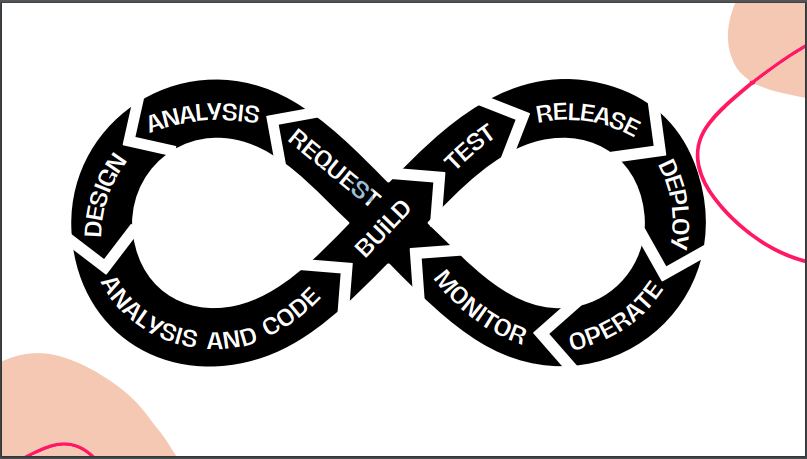

# QA e o Ciclo de Desenvolvimento
 ## QA and the Development Cycle

 **O que é quality Assurance?**
     É o nome de um cargo em inglês que significa garantia de qualidade. Então ele é aquele que garante a qualidade e, quando falamos de qualidade estamos falando de qualidade no processo como um todo, não só numa etapa do fluxo,mas em toda a etapa de desenvolvimento de software e até no acompanhamento desse software em produção.

 A seguir veremos o que um QA é e o que não é:

 O QA é:

 - Inovador na cultura de testes;
 - Responsável por disseminar a cultura de qualidade no time;
 - Define e instrui a utilização de ferramentas de teste;
 - Apoiador na criação de cenários de teste do seu time;
 - Proativo, detalhista, curioso e cooperativo.

 O QA não é:

 - inimigo do time;
 - Único responsável por garantir a qualidade do produto;
 - Único responsável pela entrega;
 - Um desenvolvedor "que deu errado";
 - Profissional que desenvolve a aplicação.

 A seguir veremos o que um QA faz e o que não faz:

 O QA faz:

 - Executa cenários de testes;
 - Antecipa inconsistências em etapas anteriores;
 - Aponta pontos de melhoria no processo;
 - Encontra, reporta e acompanha bugs;
 - Automatiza testes.
  
 O QA não faz:

 - Zera os bugs;
 - Desenvolve funcionalidades do produto;
 - Impede que bugs sejam encontrados em produção;
 - Corrige bugs.

 ## SDLC e DEVOPS

 SDLC significa **Software Development Life Cycle** e é uma metodologia que descreve fases sequenciais e processos envolvidos no desenvolvimento do software.

 Já DEVOPS significa**Development + Operations** e é uma abordagem colaborativa que visa integrar as equipes de desenvolvimento de software e operações de TI para melhorar a colaboração e eficiência.

 A seguir vamos falar brevemente sobre as etapas do **Ciclo de vida do desenvolvimento de software:**

 1. *REQUEST*: Solicitação da demanda pelo time de atendimento ou produto.
   
   É o estágio inicial, onde nasce a ideia da necessidade, e é o momento inicial também de comunicação e de construção da ideia de implementação dentro da aplicação.

 2. *ANALYSIS*: Análise do time de produto e levantamento dos requisitos.
   
   Então foi feita a *request* pelo time de produto ou de atendimento pela necessidade. A segunda parte é de analise do time de produto e o levantamento de requisitos. O PM (product manager) e o PO (product owner) trabalham nesta etapa para descrever a necessidade, levantar os requisitos e entender como uma aplicação precisa se comportar e como aquilo será implementado.

 3. *DESIGN*: Design pelo time de UX/UI com base nas necessidades levantadas pelo time de produto.
   
   Depois que o PO e o pessoal de produto fez esse levantamento de requisitos, vem a etapa de *design*,onde o time de UX (user experience) e UI (user interface) irão analisar a necessidade que o time de produto trouxe e irão trabalhar em cima dela. Eles irão desenhar com base no que o produto passou e irão fazer a experiência do usuárioe entender qual é a melhor interface para que ele possa utilizar aquela nova feature dentro da aplicação.

 4. *ANALYSIS AND CODE*: Análise e codificação pelo time de desenvolvimento.
   
   É o momento que o nosso desenvolvedor vai analisar o que foi passado para ele e ele vai fazer o levantamento técnico daquilo que ele precisa desenvolver, ou seja, ele vai entender como aquilo irá se comportar, qual é a arquitetura, qual é a máquina que ele vai precisar para fazer a implementação, se ele tem alguma necessidade externa de algum time externo... E depois ele vai codar, fazer o código da aplicação para desenvolver aquela feature.

 5. *BUILD*: Código fonte compilado e construído em um pacote executável
   
   Esta etapa de *build* nada mais é do que quando o código fonte é compilado e construído em um pacote executável.
   Aqui já começamos a entrar na parte de **DEVOPS**.
   isto tem masi a ver com as ferramentas que a equipe acaba utilizando no dia a dia para disponibilizar esses códigos, essa nova funcionalidade, seja em produção, em ambiente de homologação, ou até para pacotes. Por exemplo um aplicativo é um .APK, um executável para você poder pegar esse pacote, pegar essa nova feature e depois o build.

  6. ***TEST:*** A Etapa onde o software é  test ado para garantir seu correto funcionamento - Ex: Testes unitários, testes de integração, testes de aceite, etc.
   
   Os testes podem ser adicionados aqui nesta etapa como uma validação daquela nova funcionalidade, seja ela uma nova feature ou uma correção de bug.

 7. *RELEASE*: Momento de preparo para o software ser instalado em ambiente produtivo.
   
   Então é o momento que você irá identificar se as máquinas precisam de algum ajuste, escalar alguma máquina para que ela funcione melhor e que atenda todos os usuários que a pretendemos atender. Ou seja, é o momento de preparo daquele pacote para você conseguir dar os próximos passos.

 8. *DEPLOY*: Aqui o software é implantado em ambiente produtivo, tornando-se acessível aos usuários finais.
   
   É a etpa de fato onde você executa isso tudo que foi feito até esta etapa e, então, se torna disponível em um ambiente produtivo.

 9. *OPERATE*: Software executado em ambiente produtivo e a equipe de operações monitora o desempenho, a disponibilidade e segurança da aplicação.
   
   Então é que temos o time de operações, também atuando muito vindo do *DevOps*, que são as pessoas específicas que estão cuidando daquele software de produção, daquela aplicação em produção, de uma maneira que ela não fique indisponível, que não tenha brechas de segurança e que ela tenha um bom desempenho para que todos os usuários possam utilizá-la em ambiente produtivo.

 10. *MONITOR*: A equipe monitora o software em produção, coletando métricas, logs e dados relevantes para avaliar o desempenho e saúde da aplicação.
   
   Aqui no monitoramento, a equipe como um todo monitora, o time de operações, de desenvolvimento, de produto, de qualidade... Ou seja, o time de uma maneira geral começa a acompanhar esse software em produção, pegando logs, métricas e os dados relevantes para avaliar a saúde dessa aplicação, encontrar bugs e possibilidades de melhoria de performance.
   Então este é um momento extremamente importante, pois, a gente teve toda uma cadeia aqui, desde a etapa de requerimento até ter ela em produção. Mas, ela não acaba estando em produção pois existe um trabalho de monitorar essa aplicação e identificar falhas e oportunidades de melhoria para que ela fique cada vez melhor e cada vez com mais qualidade para os nossos usuários finais.

 Abaixo segue um gráfico das etapas que falamos acima:

 